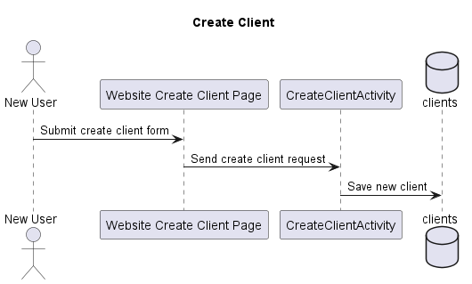
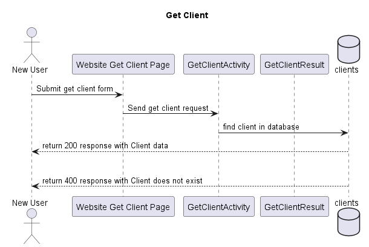
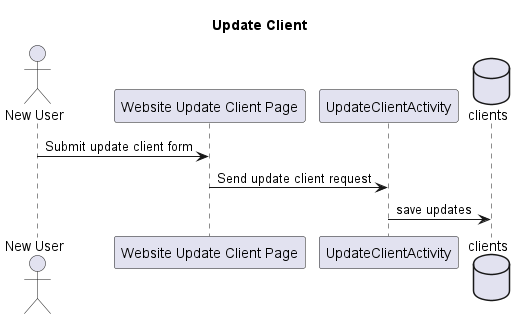
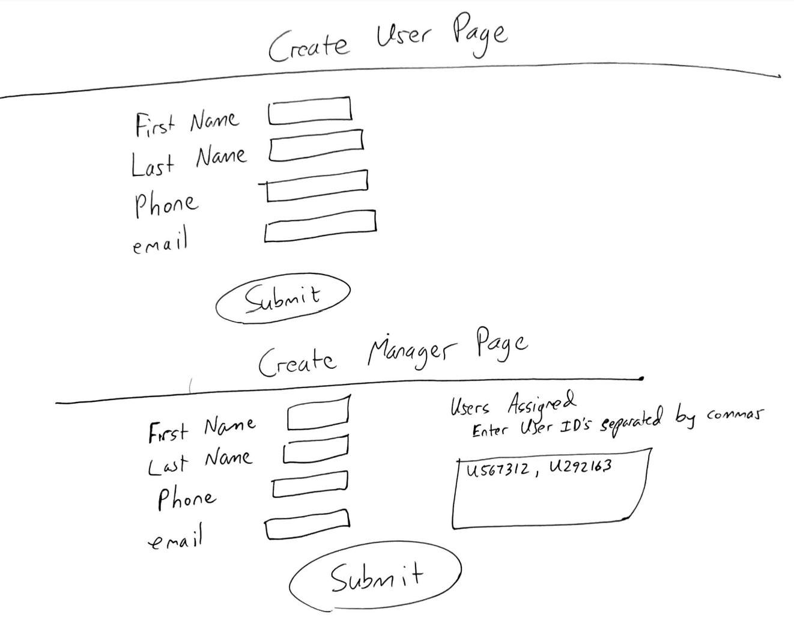
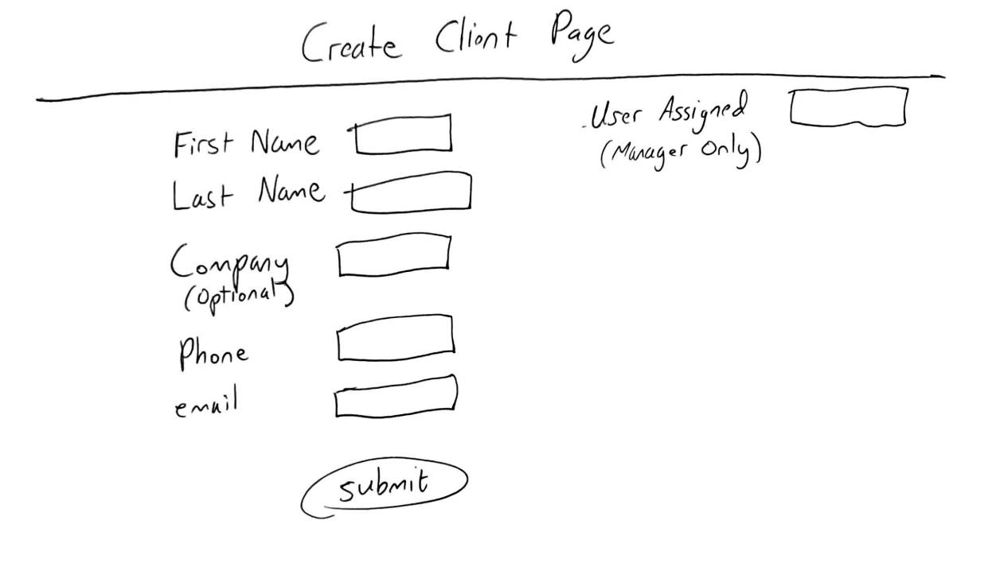
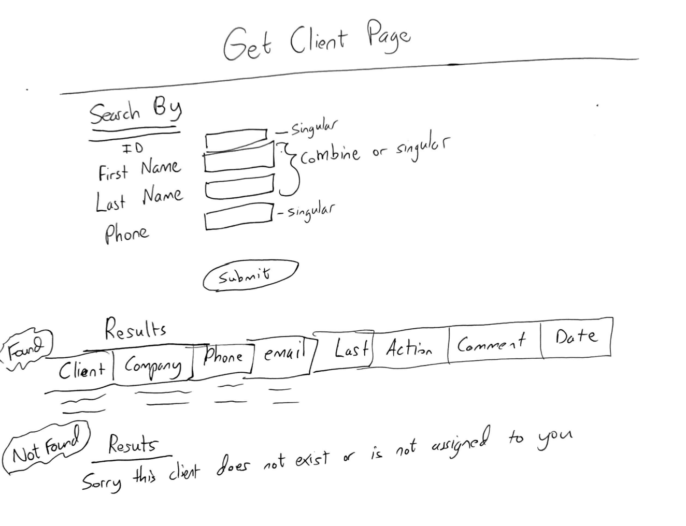
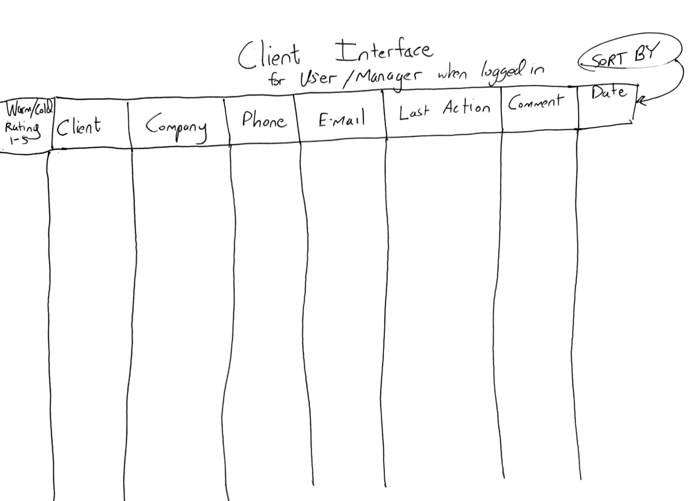
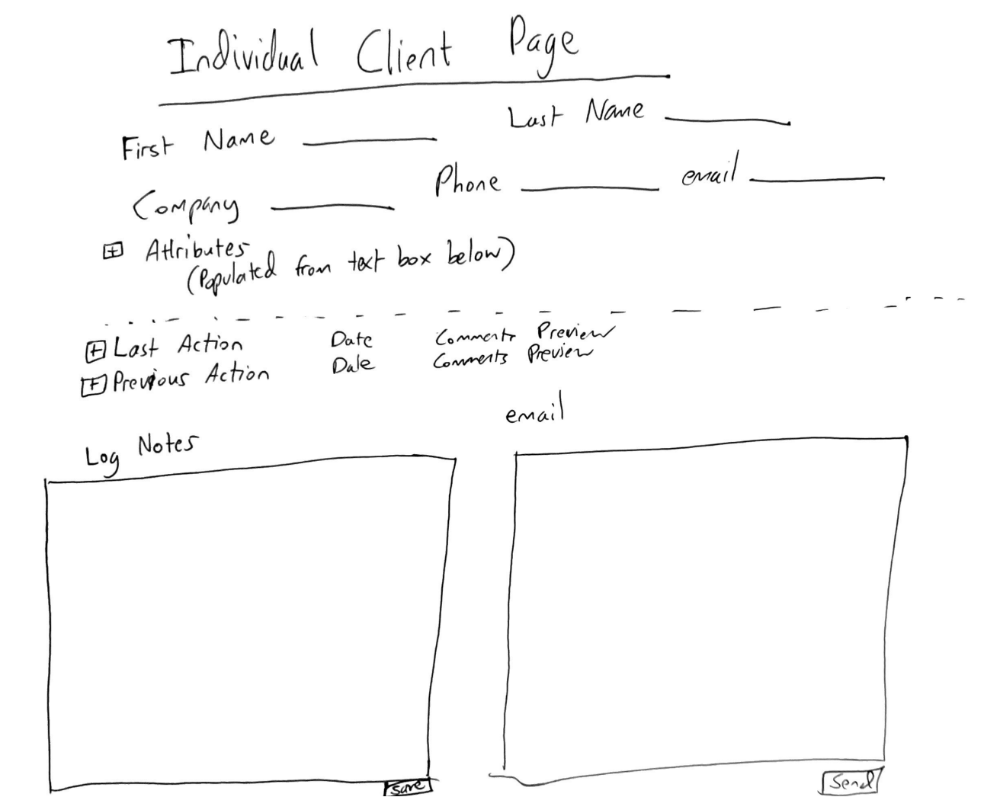

# zdisalvo Design Document

## 1. Problem Statement 

A CRM - Customer Relationship Manager, is an open interactive database that allows sales teams and customer facing entities to track their relationships and interactions with customers and prospects. The goal is to maximize efficiency for customer capture rate by giving the user tools to know when to call and email, what was talked about last, and where the relationship is in the pipeline. Most CRM’s are useful and effective but are highly complex and require an involved learning curve for the user to acquire the competence to utilize the dozens of features and nuances. The goal with this CRM is simplicity, limiting the ranges of steps and leaving more up to automation to get the job done.

## 2. Top Questions to Resolve in Review

1. Should there be a separate database for each user/manager's client numbers?

2. How to implement the sending email interface that logs the email in the CRM

## 3. Use Cases

U1. As a user I want to add a new customer with four simple data pieces, Name, Company (if applicable), email, and phone number. This should be attained prior to talking to the customer or at least on the first interaction.

U2. Call logging. As a customer I want a simple list of drop downs for the action taken. I want a large area to type out the specs of what was talked about. I want a “next step” field that tells me and a superior what the next action will be. If none is specified, the system will default to a phone call in one week, at the same time.

U3. As a user, I want my email to integrate with the CRM so that I can send an email from the CRM which will log the entire email chain.

U4. As a user, I want my technical software to sync up with the CRM to eliminate double tracking.

U5. As a user I want the manager to be able to have access to all leads on their team and reassign as necessary

U6. As I user I want to be able to sort by next follow up, last time called, first name, last name, company.

U7. As a user, I want a fluid priority action list that updates based on scheduled follow ups, type of lead,

U8. As a user, I want to be able to search for a customer by phone number, first name, last name, and company

U9. As a user, I want to be able to update any information about a customer.

U10. As a user I want to log in with my username and password and have access to the clients I own, and if I am a manger, all leads my team owns.

U11. As a user/manager I want to view all clients I have access to and be able to sort by all fields. I want to see a preview of the last comment made and last action taken.

U12. As a user/manager I want to be able to write notes in a text box and have some of those items populated as attributes of the client

U13. Wish. As a customer, I want to be able to create data type fields in a large text box, because every potential client / client is different. If a user types Birthday:, Birthday will be a data attribute, then anything comes after is recorded until a “/” slash. If there is no slash, everything will be stored until the next word that contains a colon. The data fields will be organized in alphabetical order when the user uses the get client feature, except for the main data fields, Name, Company, Phone, Email.


## 4. Project Scope

### 4.1 In Scope

* Creating a customer
* Manager, Individual lead access
* Email integration into CRM
* Call logging
* Simple interface

### 4.2 Out of Scope

* Integration with company’s technical software


## 5. Proposed Architecture Overview

This initial iteration will provide the minimum lovable product (MLP) including creating a customer, getting a customer, updating a customer, sending an email from the CRM.

We will use API Gateway and Lambda to create seven endpoints. (`CreateClient`, `GetClient`, `UpdateClient`, `EmailClient`, `ReassignClient` (Manager Only), `CreateUser`, `CreateManager`,

We will store clients, users, and managers in separate tables in DynamoDB

Clients will be assigned to Users and Managers in a List

## 6. API

### 6.1 Public Models

```
// Client Model

String firstName
String lastName
String company
String phone
String email
String textbox
String clientId
Date logDate
Enum logAction
String logComments
Date nextActionDate
Enum nextAction
String userAssigned (Key Value Pairs: user / id)
String managerAssigned (Key Value Pairs: user / id)
```

```
// User Model

String firstName
String lastName
String phone
String email
String Employee Id (Starts with U)
```

```
// Manager Model

String firstName
String lastName
String phone
String email
String Employee Id (Starts with M)
```

### 6.2 Create Client Endpoint

* Accept a POST request to /clients
* Accepts data to create a client with a first name, last name, company (if applicable), phone, and email. Returns the client including a unique client ID assigned to the CRM service
* Client name format validation mechanism
* Client phone format mechanism - phone number will carry 10 digits, plus extension if applicable



### 6.3. Get Client Endpoint

* Accept a GET request to /clients
* Accepts a client ID or phone number, returns a client
* Accepts a first name or last name and returns a list of clients that match which the user or manager owns. The client can be selected which will take them to the client page.
* If the client is not found a message stating that no clients matched will be returned to the user.
* Multiple results can be returned that match the query, user can select a client to access




### 6.4 Update Client Endpoint

* Accept a PUT request to /clients
* Accepts a client ID only and updates the client phone number, email, and the text box which carries information about the client



### 6.5 Create User/Manager Endpoint

* Accepts a POST request to /users
* Accepts data to create a user with first name, last name, phone, email, a sequential user id will be assigned. Returns the user including the newly assigned id

### 6.6 Reassign Clients Endpoint

* Accepts a PUT request to /clients to change the owner of the client to a different user id

### 6.7 Client Interface

* Users can access all of their assigned clients and create clients
* Users can log the action taken (call, email), and make comments about what transpired
* Users can sort clients in the interface by all attributes
* Users can log extensive notes in a text box

## 7. Tables

### 7.1 clients

```
id // partition key, string
firstName // string
lastName // string
company // string
phone // string
email // string
clientId // string
logDate // date
logAction // enum
logComments // string
nextActionDate // date
nextAction // enum
userAssigned (id) // string
managerAssigned (id) // string
```

### 7.2 users (managers included, and their id numbers will begin with an “M’, users will have a U start to their id)

```
id // partition key, string
userName // string
firstName // string
lastName // string
company // string
phone // string
email // string
```













